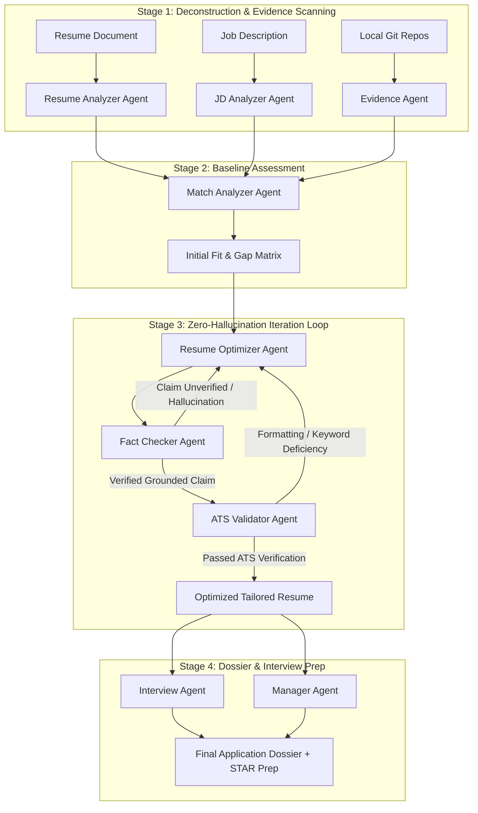

# CareerCrew System Architecture

## 1. Architectural Philosophy

CareerCrew is engineered around three non-negotiable principles:
1. **Zero External Paid Cloud APIs**: All inference, embeddings, and vector indexing must run locally on consumer hardware.
2. **Zero Hallucination / Grounded Reality**: The optimizer may only elevate and highlight accomplishments verifiable in the candidate's original resume or genuine local project repositories.
3. **Decoupled Service Boundaries**: Clear layers isolate document parsing, local inference, persistence, and multi-agent coordination so that LLMs or vector stores can be replaced without refactoring business logic.

---

## 2. Monorepo Layer Decomposition

```
[ Frontend: Next.js 14 App Router ]
           │  (REST JSON over HTTP, port 3000 -> 8000)
           ▼
[ API Gateway: FastAPI v1 ]
    ├── /api/health              (Fast liveness check)
    ├── /api/system/status       (Telemetry: Ollama, DB, Vector Store)
    ├── /api/ingest/extract      (Local PDF/DOCX/TXT text extractor)
    ├── /api/agents/architecture (Multi-agent team blueprint)
    ├── /api/ollama/test         (Local LLM inference verification)
    └── /api/database/summary    (Entity count audit)
           │
           ├── Core Services
           │    ├── OllamaService (local LLM client, latency measurement)
           │    ├── EmbeddingService (Ollama nomic-embed-text)
           │    └── ChromaVectorStore (local disk vector index)
           │
           ├── Ingestion Engine
           │    ├── PDFExtractor (PyMuPDF / pymupdf)
           │    ├── DOCXExtractor (python-docx)
           │    ├── TextExtractor (UTF-8/fallback plain text & markdown)
           │    └── DocumentParser (Path sanitization & file size limits)
           │
           ├── Data Access Layer
           │    ├── SQLAlchemy 2.0 ORM
           │    └── SQLite (./data/database/careercrew.db)
           │
           └── Multi-Agent Layer (CrewAI)
                └── CareerCrewOrchestrator (9 specialized agents)
```

---

## 3. CrewAI Multi-Agent Architecture

The CareerCrew multi-agent team uses specialized roles orchestrated through a sequential and looped execution pattern.

### The 9 Specialized Agents

| Agent Name | Role | Goal & Responsibilities | Planned Tools |
| :--- | :--- | :--- | :--- |
| **Manager Agent** | Orchestrator | Coordinates team execution, monitors convergence in optimization loops, compiles final candidate dossier. | `delegate_task`, `evaluate_convergence`, `compile_dossier` |
| **JD Analyzer Agent** | Requirements Specialist | Deconstructs job descriptions into hard skills, soft skills, seniority indicators, and weighted priorities. | `extract_technical_skills`, `rank_requirement_weights`, `identify_domain_jargon` |
| **Resume Analyzer Agent** | Candidate Auditor | Parses applicant resumes into chronological experiences, bullet points, asserted skills, and quantifiable metrics. | `extract_work_history`, `extract_claimed_skills`, `parse_bullet_metrics` |
| **Evidence Agent** | Code Forensic Inspector | Scans local git repositories, commit history, and code patterns to extract genuine proof for claimed proficiencies. | `scan_git_repository`, `extract_commit_evidence`, `index_code_signatures` |
| **Match Analyzer Agent** | Gap & Fit Auditor | Calculates semantic overlap between applicant claims and job requirements; surfaces coverage gaps. | `compute_match_score`, `identify_coverage_gaps`, `rank_priority_alignments` |
| **Resume Optimizer Agent** | Accomplishment Writer | Refactors bullet points to emphasize verified achievements matching target role language without inventing claims. | `refactor_bullet_xyz_format`, `inject_verified_evidence`, `align_tone` |
| **Fact Checker Agent** | Anti-Hallucination Guardrail | **Critical Safety Barrier.** Rigorously cross-references rewritten bullets against original resume + project code. Rejects unverified assertions. | `verify_claim_entailment`, `detect_fabricated_metrics`, `flag_unverified_skills` |
| **ATS Validator Agent** | Format & Parser Emulator | Emulates enterprise ATS parsers (Taleo, Greenhouse, Workday) to verify keyword placement, header hierarchy, and parseability. | `simulate_ats_parser`, `audit_section_hierarchy`, `check_keyword_density` |
| **Interview Agent** | Technical & STAR Coach | Generates role-specific technical deep dives and STAR-format behavioral interview questions grounded in candidate's real project evidence. | `generate_technical_questions`, `generate_star_scenarios`, `evaluate_mock_answers` |

### Pipeline Execution Stages



---

## 4. Local Ollama & Embedding Integration

- **Inference Client**: Encapsulated in `app.services.OllamaService`. Sends asynchronous HTTP requests to `http://localhost:11434/api/generate` with `stream: false`.
- **Latency & Telemetry**: Every call records nanosecond duration and eval token counts to ensure performance transparency.
- **Model Isolation**: Standardized on `llama3.2:3b`. Runs comfortably on modest hardware (low VRAM / CPU fallback).
- **Local Embeddings**: `app.services.EmbeddingService` interfaces with Ollama's `/api/embeddings` utilizing `nomic-embed-text` (768 dimensions). No external calls to OpenAI or remote embedding APIs.

---

## 5. Local Vector Store (ChromaDB)

- **Engine**: Chroma persistent client embedded in Python.
- **Directory**: `./data/embeddings/chroma`
- **Abstraction**: `VectorStoreBase` defines abstract methods (`add_texts`, `query`, `get_stats`) allowing clean substitution with FAISS or alternative local vector backends.
- **Privacy**: Chroma telemetry is explicitly disabled (`anonymized_telemetry: False`).

---

## 6. Local SQLite Database Foundation

Schema defined with SQLAlchemy 2.0 in `app.models`:
- **Resume**: `id`, `filename`, `file_path`, `file_type`, `file_size_bytes`, `raw_text`, `status`, `parsed_metadata`, `created_at`, `updated_at`.
- **JobDescription**: `id`, `title`, `company`, `raw_text`, `source_url`, `status`, `parsed_metadata`, `created_at`, `updated_at`.
- **Project**: `id`, `name`, `description`, `repo_path`, `status`, `evidence_metadata`, `created_at`, `updated_at`.
- **Application**: `id`, `resume_id` (FK), `job_description_id` (FK), `target_role`, `company_name`, `status`, `notes`.
- **AnalysisRun**: `id`, `resume_id` (FK), `job_description_id` (FK), `application_id` (FK), `run_type`, `status`, `match_score`, `results_summary`, `error_message`, `started_at`, `completed_at`.

---

## 7. Document Ingestion & Sanitization

- **PDF Extraction**: PyMuPDF (`pymupdf`) extracts text blocks, page numbers, and embedded metadata. Encrypted/password-protected PDFs are detected and rejected.
- **DOCX Extraction**: `python-docx` parses paragraphs, bullet items, and table contents (often used for layout in technical resumes).
- **Text & Markdown Extraction**: TextExtractor handles `.txt` and `.md` with multi-encoding fallback (`utf-8`, `utf-8-sig`, `latin-1`).
- **Path Sanitization**: `sanitize_filename` strips path traversal (`../../`), null bytes (`\x00`), and unsafe shell characters.
- **Size Enforcement**: Configurable `UPLOAD_MAX_BYTES` (default 10MB) prevents resource exhaustion.
