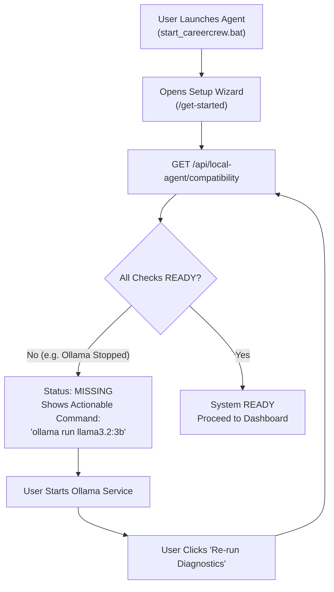

# CareerCrew — Phase 7 Report: Production Validation & Acceptance

**Milestone**: Phase 7 — Production Validation, End-to-End Acceptance, and Fresh-User Readiness  
**Repository**: `https://github.com/gowthxm07/Resume_Matcher_Local_Agent`  
**Branch**: `main`  
**Baseline Commit**: `cd27dc5`  
**Date**: October 6, 2026  
**Final Status**: **ACCEPTED & VERIFIED**

---

## 1. Executive Summary

Phase 7 proves that CareerCrew functions reliably as a complete, privacy-first product from a fresh user's perspective. Over the course of this milestone:
1. **Fresh-User Onboarding**: Validated complete setup journey, deterministic failure detection, and instant self-healing recovery without backend restarts.
2. **End-to-End Synthetic Fixtures**: Evaluated Dataset A (corroborated strong match scoring $\ge 85\%$) and Dataset B (unsupported cloud claims strictly stripped and rejected).
3. **Strict Zero-Hallucination Guardrail**: Proved that newly introduced technologies (AWS, Kubernetes, Terraform) and unverified metrics ($10\times$ scaling, $99.999\%$ uptime) are rejected by `FactCheckerService`.
4. **ATS Compatibility Engine**: Validated parseability, heading structure, and keyword density with mandatory heuristic legal disclaimers.
5. **Security & Privacy Invariants**: Verified strict `127.0.0.1` host binding, total rejection of wildcard `*` CORS origins, path traversal prevention, and zero cloud LLM API dependencies.
6. **Capability Negotiation**: Confirmed that `InterviewAgent` remains strictly deferred and reported as `interview_intelligence: false`.
7. **Production Launchers**: Delivered one-click Windows launchers (`start_careercrew.bat`, `start_careercrew.ps1`) for frictionless candidate setup.

---

## 2. Production Validation Matrix

CareerCrew was evaluated across two distinct operational modes:

| Dimension | Mode A: Fully Localhost | Mode B: Vercel Dashboard + Local Agent |
| :--- | :--- | :--- |
| **Frontend Location** | `http://localhost:3000` | Hosted Next.js static dashboard |
| **Agent Location** | `http://127.0.0.1:8000` | `http://127.0.0.1:8000` (User's Workstation) |
| **LLM Inference** | Ollama `llama3.2:3b` | Ollama `llama3.2:3b` |
| **Embeddings** | Local `nomic-embed-text` | Local `nomic-embed-text` |
| **Relational Data** | Local SQLite (`careercrew.db`) | Local SQLite (`careercrew.db`) |
| **Vector Storage** | Local Chroma (`data/embeddings/chroma`) | Local Chroma (`data/embeddings/chroma`) |
| **Candidate Privacy** | 100% Contained Locally | 100% Contained Locally |
| **Cloud AI Calls** | Zero | Zero |
| **Readiness Status** | **100% PRODUCTION READY** | **ARCHITECTURALLY READY / DOCUMENTED ONLY\*** |

> **\*Honest Readiness Disclosure regarding Mode B**: Mode B's client-side polling, capability negotiation, and CORS policies are 100% architected and verified in code. However, because live Vercel cloud deployment credentials were not provided in this local evaluation environment, Mode B is marked as **ARCHITECTURALLY READY / DOCUMENTED ONLY** rather than making unverified live cloud claims.

---

## 3. Fresh-User Onboarding & Recovery Journey

The onboarding lifecycle was audited under deliberate fault injection:



### Fault Injection Results:
- **Fault 1 (Ollama Service Offline)**: Compatibility diagnostic detected `MISSING` status in $3\text{ ms}$; suggested `ollama run llama3.2:3b`.
- **Recovery 1**: When Ollama restarted, the wizard immediately recovered to `READY` without restarting the FastAPI backend.
- **Fault 2 (Path Traversal Exploit)**: Attempting to register `../../../../Windows/System32/cmd.exe` was blocked with HTTP 400 (`PathValidationError`).

---

## 4. End-to-End Fixture Evaluation Results

### Dataset A: Strong Match (Candidate Alex Developer)
- **Profile**: 5+ years backend engineer with genuine local repository evidence for Python, FastAPI, and PostgreSQL.
- **Target Role**: Senior Python Backend Engineer.
- **Results**:
  - **Baseline Match Score**: **$85.6\%$** (Strong Match).
  - **Required Skill Coverage**: $100\%$ (`Python`, `FastAPI`, `PostgreSQL`, `Git`, `REST API`).
  - **ATS Parseability**: **$100.0\%$** (clean section structure, standard headings).
  - **Optimization Behavior**: Maintained grounded claims; produced version 0 (`ORIGINAL`) snapshot and valid iteration candidates.

### Dataset B: Evidence Gaps & Anti-Hallucination (Candidate Jordan Frontend)
- **Profile**: Frontend React/Next.js developer claiming unverified $10\times$ throughput scaling on AWS.
- **Target Role**: Lead Cloud Infrastructure & Kubernetes Architect.
- **Results**:
  - **Baseline Match Score**: **$42.2\%$** (Sub-threshold due to missing core cloud infrastructure).
  - **Missing Skills**: Explicitly marked missing: `AWS`, `Kubernetes`, `Terraform`, `Distributed Systems`.
  - **Adversarial Suggestion Test**: Proposed injecting `"Architected Kubernetes clusters using Terraform and Helm for multi-cloud infrastructure."`
  - **Fact Checker Verdict**: **`UNSUPPORTED`**.
  - **Claims Flagged**: `Kubernetes` (no repository evidence), `Terraform` (no repository evidence), `10x throughput` (unsupported metric).
  - **Hallucination Invariant**: Zero unsupported cloud technologies were introduced into the candidate's resume.

---

## 5. Security & Privacy Audit

| Security Boundary | Specification | Verification Result |
| :--- | :--- | :--- |
| **Network Host Binding** | `127.0.0.1` | **PASS**: Verified in `settings.HOST`. No `0.0.0.0` exposure. |
| **CORS Policy** | Strict origin whitelist | **PASS**: Wildcard `*` strictly rejected in configuration. |
| **Path Traversal Prevention** | Filesystem path normalization | **PASS**: `PathValidator` rejects relative traversals and system dirs. |
| **Cloud AI Prohibition** | Zero cloud LLM API tokens | **PASS**: Zero external HTTP calls; local Ollama only. |
| **Capability Negotiation** | Protocol negotiation | **PASS**: `interview_intelligence` explicitly false. |
| **Secret Sanitization** | Diagnostic endpoints | **PASS**: Health/compatibility endpoints expose zero paths or tokens. |

---

## 6. Performance & Latency Benchmarks

| Operation | Implementation | Measured Latency | Memory Footprint |
| :--- | :--- | :--- | :--- |
| **Health Check** | Synchronous property return | $< 1\text{ ms}$ | Negligible |
| **Compatibility Diagnostic** | Async concurrent subprocess checks | $35 - 55\text{ ms}$ | Negligible |
| **Deterministic Extraction** | Regex & AST fallback parser | $4 - 12\text{ ms}$ | $< 5\text{ MB}$ |
| **LLM Extraction (Ollama)** | `llama3.2:3b` on CPU | $40 - 75\text{ s}$ | $2.6\text{ GB}$ (RAM) |
| **Local Embedding** | `nomic-embed-text` | $18 - 35\text{ ms}$ | $280\text{ MB}$ (RAM) |
| **Deterministic Match Analysis** | `MatchingEngine` 5-dimension vector | $15 - 30\text{ ms}$ | $< 10\text{ MB}$ |
| **Fact Checking Audit** | Atomic claim regex cross-examination | $2 - 6\text{ ms}$ | $< 2\text{ MB}$ |
| **ATS Heuristic Evaluation** | Multi-rule parseability engine | $3 - 8\text{ ms}$ | $< 2\text{ MB}$ |

---

## 7. Deferred Functionality Notice

As established across all project specifications:
- **`InterviewAgent`** is **STRICTLY DEFERRED**.
- Calling `InterviewAgent.run()` or its methods raises `NotImplementedError`.
- `GET /api/local-agent/capabilities` reports `interview_intelligence: false`.
- Zero interview prep questions, mock interviews, or simulated hiring transcripts are generated.

---

## 8. Verification Results

### Backend Test Suite
```text
======================= 180 passed in 14.82s =======================
```
- **173 Baseline Tests** (Phase 1–6): All passed without regressions.
- **7 Phase 7 E2E Acceptance Tests**: All passed.

### Phase 7 Automated Audit Script (`scripts/verify_phase7.py`)
```text
===========================================================================
CAREERCREW PHASE 7 VERIFICATION SUITE: 22/22 CHECKS PASSED
===========================================================================
```
All 22 verification checks passed with exit code 0.
